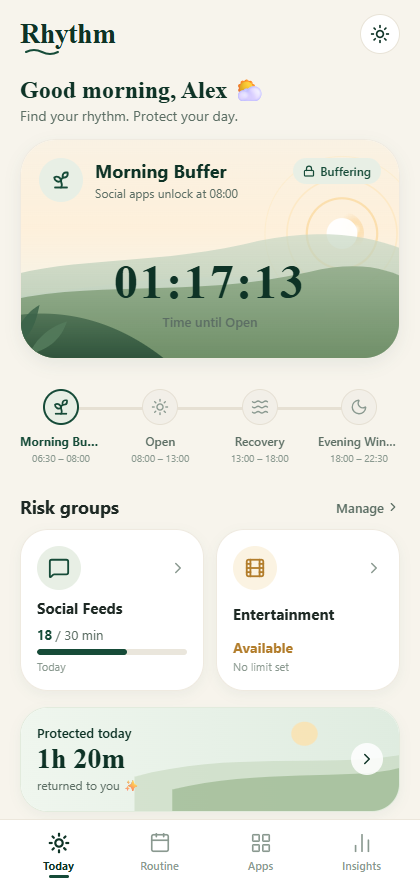
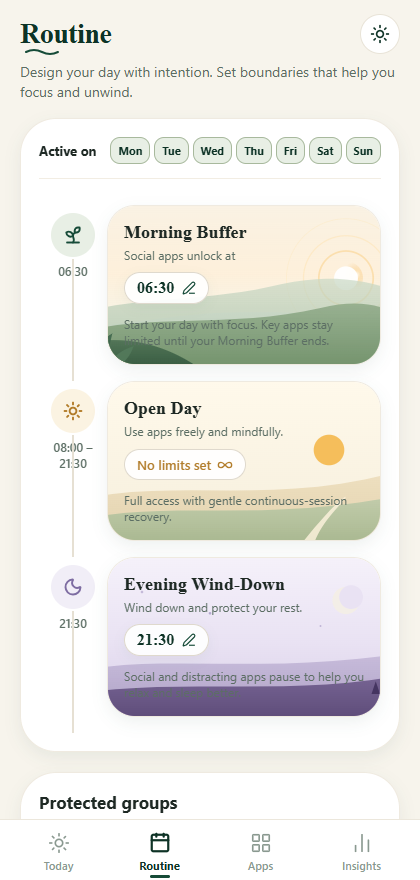
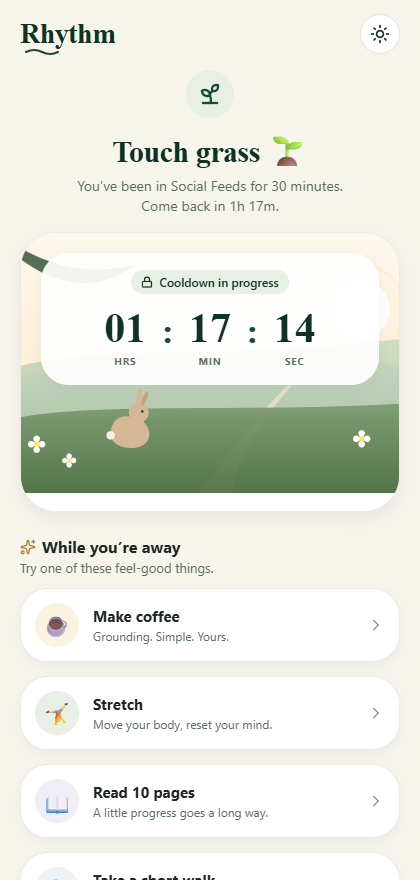
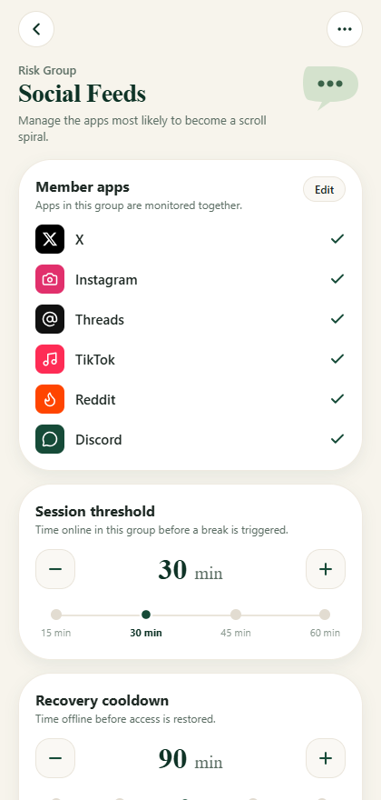

# Rhythmic-Routine 🌿

> **"Use your phone. Just don’t live in it."**

**Rhythmic-Routine** is an open-source digital wellbeing application designed around **natural digital rhythm** rather than punitive daily screen-time quotas.

Instead of locking you out of your device with arbitrary limits, Rhythm structures your day into intentional focus buffers, provides continuous-session recovery periods, and groups related scroll-heavy apps to protect your attention.

---

## 📸 Portfolio Mockups & Visual Identity

<div align="center">
  
  
  
  
</div>

*All high-resolution application screen mockups are available in [`docs/portfolio-mockups/`](docs/portfolio-mockups).*

---

## ✨ Core Pillars

1. **Morning Buffer** ⛅
   * Postpone morning doomscrolling by keeping distracting apps unavailable until your chosen waking boundary (e.g., 08:00 AM).
2. **Evening Wind-Down** 🌙
   * Help your mind disconnect before sleep by gently pausing social feeds and entertainment after your evening threshold (e.g., 21:30 PM).
3. **Risk Groups** 🛡️
   * Monitor related apps collectively (e.g. *X, Instagram, TikTok, Reddit, Discord* share continuous session limits).
4. **Touch Grass Recovery** 🌱
   * Reaching a session threshold (e.g. 30 min of continuous browsing) triggers a mandatory offline recovery period (e.g. 90 min) with feel-good grounding suggestions.
5. **Essential-App Invariant Safety** 🔒
   * Core utility apps (*Phone, Maps, Camera, Clock*) are strictly classified as **Essential** and are never restricted under any routine or cooldown.

---

## 🛠️ Current Status: Pass 01 & 01A (Frontend Prototype & Reconciliation)

This repository contains the completed **Pass 01 & Pass 01A frontend experience prototype**:

* **Universal Web & Mobile Shell:** Powered by Expo Router (file-based navigation) and React Native Web.
* **Platform Service Composition:** Clear native interface boundaries (`UsageProvider`, `RestrictionProvider`) wired through a service registry (`PlatformServices.ts`).
* **Authoritative State Engine:** Centralized Zustand store owning countdown timestamps (`activeTimerEndsAt`), reactive routine time models, and automated expiry lifecycle.
* **Local-First & Zero Backend:** Completely standalone — no cloud auth, Supabase, Firebase, or remote tracking.

---

## 🚀 Tech Stack

* **Framework:** [Expo SDK 57](https://expo.dev) + [Expo Router](https://docs.expo.dev/router/introduction/)
* **UI & Components:** [React Native](https://reactnative.dev), [React Native Web](https://necolas.github.io/react-native-web/), [Lucide React Native](https://lucide.dev)
* **Vector Graphics & Artwork:** [React Native SVG](https://github.com/software-mansion/react-native-svg)
* **State Management:** [Zustand](https://github.com/pmndrs/zustand)
* **Code Quality & Testing:** TypeScript, ESLint (Expo Flat Config), Node Test Runner (`tsx`)

---

## 📦 Getting Started

### Prerequisites
* Node.js `20.x` or higher
* npm or yarn

### Installation
```bash
git clone https://github.com/Terinit-Technologies-Development/Rhythmic-Routine.git
cd Rhythmic-Routine
npm install
```

### Running the Development Server
```bash
# Start the web client
npm run web

# Start Expo dev client for mobile simulators
npm run start
```

### Quality & Testing Commands
```bash
# Run unit tests for domain selectors and helpers
npm test

# Run TypeScript typecheck
npm run typecheck

# Run ESLint check
npm run lint

# Export static production web bundle
npm run build:web
```

---

## 🛣️ Roadmap

* **Pass 01 & 01A (Complete):** Design system, routes, UI components, prototype state engine, and platform service composition.
* **Pass 02 (Planned):** Native device integration:
  * Android `UsageStatsManager` / `AccessibilityService` background monitoring.
  * iOS `FamilyControls` & `ManagedSettings` Screen Time framework.
  * Local SQLite persistent storage for routine windows and classification records.

---

## 📄 License

MIT License. Free and open source for mindful digital wellbeing.
